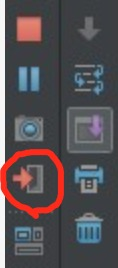

# Eureka Graceful Shutdown

## 什么是优雅关闭？
   优雅关闭是指在关闭前做必要的操作后再关闭应用程序，不同于简单粗暴直接关闭程序的方法，跟后者比更加文明、优雅，因而得名。
   
## 优雅关闭本地服务
  命令行模式：`kill pid` 发送默认信号：15 SIGTERM  
  Idea：  
  eclipse: 暂不支持  
  docker：docker stop 或 docker-compose stop

## spring-boot环境下Eureka Instance(应用/服务实例)的Graceful Shutdown
### 分析
下面以Eureka Instance收到关闭指令后的处理流程为例说明Eureka的关闭流程

+ Eureka Instance收到关闭指令后会自动触发通知Eureka Server的操作

日志中能看到如下字段

    Shutting down DiscoveryClient ...

查看com.netflix.discovery.DiscoveryClient代码：

    public class DiscoveryClient implements EurekaClient {
    
      @PreDestroy
      @Override
      public synchronized void shutdown() {
        ...
      }  
    }

会发现有关闭处理注解@PreDestroy

+ Eureka Server收到Instance cancel register的请求后，立刻执行相应的操作，比如更新连接数、更新租约阈值值。

+ Eureka Server返回给Eureka Client的值会存在一个缓存里，默认每隔30s（eureka.responseCacheUpdateIntervalMs）更新一下缓存值。  

+ Eureka Client本地也有缓存，默认情况下，Client每隔30s（eureka.client.refresh.interval）跟服务器端同步一下信息。

总结：由于EurekaServer和EurekaClient都有缓存，所以Client获得服务变动消息会有一个延迟。
延迟时间为0 ~ (eureka.responseCacheUpdateIntervalMs + eureka.client.refresh.interval)

### 验证
+ 启动instance，获得进程pid，以便下一步使用
+ 模拟关闭instance，并不停查询instance，获取instance信息变化，得出变化时间

以下时关键测试代码，在mac上测试通过，可做参考

    Runtime.getRuntime().exec("kill "+pid); //pid 为instance 进程id，环境不同id不同，需要在执行时传入

    EurekaClient eurekaClient = new DiscoveryClient(applicationInfoManager, clientConfig);
    Application application = eurekaClient.getApplication("MICROSERVICE-PROVIDER-USER");
    if (application == null) {
        System.err.println("no application:" + i);
        break;
    } else {
        InstanceInfo instance = application.getByInstanceId("discovery:microservice-provider-user:8000");
        if (instance == null) {
            System.err.println("no intance:" + i);
            break;
        } else {
            if (instance.getStatus() == InstanceStatus.DOWN) {
                System.err.println("intance-- down :" + i);
                break;
            } else {
                System.err.println("intance :" + i + " " + instance.getStatus());
            }
        }
    }

## Spring Boot环境下Eureka的暴力Shutdown本地服务
暴力关闭时，由于缺少通知机制，只能通过租约过期来判断服务是否有效。  

+ 保护模式，不会删除租约过期的服务，此时客户端不会得到此Instance的真实状态信息
+ 普通模式下，默认每隔1m（eureka.evictionIntervalTimerInMs）检查一次租约是否过期；  

默认租约过的时间是90s（eurka.lease.duration），但由于代码上的bug，实际过期时间是其2倍，对应此处为180。默认情况下，客户端获得信息的时间为：2 \* eurka.lease.duration ~ 2 \* eurka.lease.duration+ eureka.evictionIntervalTimerInMs + eureka.client.refresh.interval

bug对应的[官方注释](https://github.com/Netflix/eureka/blob/v1.6.1/eureka-core/src/main/java/com/netflix/eureka/lease/Lease.java) line:103

    Note that due to renew() doing the 'wrong" thing and setting lastUpdateTimestamp to +duration more than what it should be, 
    the expiry will actually be 2 * duration.
    This is a minor bug and should only affect instances that ungracefully shutdown. 
    Due to possible wide ranging impact to existing usage, this will not be fixed.

+ 验证。将上面样例代码中的kill改成kill -9即可。

## 补充说明
### Docker环境下的注意事项
dockerfile文件启动jar时如果是直接启动的，不需要做特殊处理；如果是通过shell脚本间接启动的，SIGTERM不会从shell传递到java进程，需要参照[这个文档](http://veithen.github.io/2014/11/16/sigterm-propagation.html)进行修改。

目前我们采用的修改是在java指令前exec，如下所示

    exec java ${JAVA_OPTS} -jar *.jar;

### 当服务硬关闭时Eureka Instance的变化是否可以立即通知到依赖它的其它服务?
根据我们与spring-cloud-netflix开发人员的沟通以及netflix上issues上讨论可以看出官方的态度是暂不考虑对立刻通知的支持。
issues地址如下:
https://github.com/spring-cloud/spring-cloud-netflix/issues/1453
https://github.com/Netflix/eureka/issues/820

netflix和spring-cloud官方不支持立刻通知的原因是:
nextflix设计的这套微服务方案大量使用客户端故障检测隔离和客户端负载均衡，使得整体架构具备更好的弹性和容错性。
强调高可用性，允许Eureka上存在脏数据，对于无法访问的节点客户端会自动剔除或降权，稍后重试等等，这些机制足以保证正常工作。
服务是否可用或性能如何以服务消费者(客户端)视角为准，而不是以Eureka或Zookeeper为准。

## 如何优雅关闭线上spring-boot服务

+ 引入下列依赖以获得`/pause`和`/shutdown` management endpoints(provided by actuator)

    <dependency>
        <groupId>org.springframework.cloud</groupId>
        <artifactId>spring-cloud-starter</artifactId>
    </dependency>
    <dependency>
        <groupId>org.springframework.boot</groupId>
        <artifactId>spring-boot-starter-actuator</artifactId>
    </dependency>

+ A POST to `/pause` will result in a status of DOWN in eureka (thanks to cloud-starter)
+ When the eureka clients receive the status, Ribbon won't route any request to your DOWN service.
+ Wait for the application cool down (no more RPC call).
+ Posting to /shutdown will gracefully stop the application.

参考文档  
[spring-eureka-gently-shutdown-a-service](http://stackoverflow.com/questions/33231664/spring-eureka-gently-shutdown-a-service)
http://stackoverflow.com/questions/32969360/spring-feign-failover
