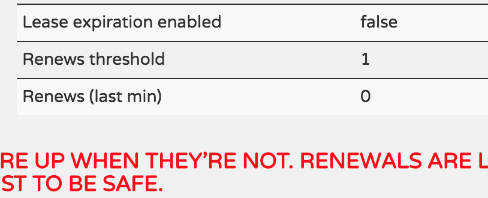

# 自我保护模式

## 什么是自我保护模式
通常情况下，Eureka Instance在Eureka Server上注册后，会定期发送心跳，Eureka Server通过心跳来判断Eureka Instance是否健康，同时会定期删除超过一定时长没有发送心跳的Instance。通常有两种情况会导致Eureka Server收不到Instance的心跳，一是Instance自身原因所致，比如故障或关闭；一是Instance与Server之间的网络出现故障。通常前者只会导致个别Instance出现故障，一般不会出现大批量的故障，而后者通常会导致Eureka Server在短时间内无法收到大批心跳。考虑到这个区别，Eureka设定了一个阀值，当判断挂掉的Instance数量超过阀值时，Eureka Server认为很大程度上出现了网络故障，将不再删除心跳过期的Instance。我们把这种模式叫着Eureka Server的自我保护模式。    
注意进入自我保护模式只是不删除心跳过期的Instance,正常的注册和注销依然正常进行。
  
## 优点和缺点   
+ 优点  
如果Eureka服务节点在短时间里丢失了大量的心跳连接(注：可能发生了网络故障)，那么这个 Eureka节点会进入”自我保护模式“，同时保留那些“心跳死亡“的服务注册信息不过期。此时，这个Eureka节点对于新的服务还能提供注册服务，对 于”死亡“的仍然保留，以防还有客户端向其发起请求。当网络故障恢复后，这个Eureka节点会退出”自我保护模式“。Eureka的哲学是，同时保 留”好数据“与”坏数据“总比丢掉任何”好数据“要更好，所以这种模式在实践中非常有效。  
同时，Eureka还有客户端缓存功能(注：Eureka分为客户端程序与服务器端程序两个部分，客户端程序负责向外提供注册与发现服务接口)。 所以即便Eureka集群中所有节点都失效，或者发生网络分割故障导致客户端不能访问任何一台Eureka服务器;Eureka服务的消费者仍然可以通过 Eureka客户端缓存来获取现有的服务注册信息。甚至最极端的环境下，所有正常的Eureka节点都不对请求产生响应，也没有更好的服务器解决方案来解决这种问题时;得益于Eureka的客户端缓存技术，消费者服务仍然可以通过Eureka客户端查询与获取注册服务信息，这点很重要。
+ 缺点  
可能会存在误判，进入保护模式后，即便Instance真的挂掉了，也可能不被Server删除。采用Eureka做服务发现时，需要客户端考虑并处理这种情况。  

## 处理机制   
+ 回收线程（Eureka-EvictionTimer）  
  + 功能：定期回收心跳过期的Instance
  + 重要参数：  
回收周期 eureka.evictionIntervalTimerInMs  默认值：1m
心跳间隔 eureka.lease.renewalInterval      默认值：30s
心跳过期时长 eureka.lease.duration          默认值：90s
是否开启自我保护模式 eureka.enableSelfPreservation   默认：true
心跳比例阀值  eureka.renewalPercentThreshold        默认值：0.85

 + 处理流程伪代码：

        if(!isLeaseExpirationEnabled())  
        {
          return;  
        } else {  
          //获得可以回收的数量  
          //随机回收心跳过期的Instance，回收数量为上一步得到的数量  
        }

 + 注意事项：  
 1、回收线程在计算心跳时，默认心跳间隔为30s，对应1m产生2个心跳。如果Instance修改了心跳间隔会导致回收线程计算错误。

          AbstractInstanceRegistry -- 》
        // Since the client wants to cancel it, reduce the threshold
        // (1 for 30 seconds, 2 for a minute)
          this.expectedNumberOfRenewsPerMin = this.expectedNumberOfRenewsPerMin + 2;
          this.numberOfRenewsPerMinThreshold = 
                (int) (this.expectedNumberOfRenewsPerMin * serverConfig.getRenewalPercentThreshold());

   2、由于心跳处理时的bug，导致在计算时的心跳过期时长=设定值的2倍。
   
   
     * Checks if the lease of a given {@link com.netflix.appinfo.InstanceInfo} has expired or not.
     *
     * Note that due to renew() doing the 'wrong" thing and setting lastUpdateTimestamp to +duration more than
     * what it should be, the expiry will actually be 2 * duration. This is a minor bug and should only affect
     * instances that ungracefully shutdown. Due to possible wide ranging impact to existing usage, this will
     * not be fixed.
     *
     * @param additionalLeaseMs any additional lease time to add to the lease evaluation in ms.
     */
     public boolean isExpired(long additionalLeaseMs) {
        return (evictionTimestamp > 0 || System.currentTimeMillis() > (lastUpdateTimestamp + duration + additionalLeaseMs));
     }
   
   
     /**
      * Renew the lease, use renewal duration if it was specified by the
      * associated {@link T} during registration, otherwise default duration is
      * {@link #DEFAULT_DURATION_IN_SECS}.
      */
     public void renew() {
         lastUpdateTimestamp = System.currentTimeMillis() + duration;
     }
     
     
3、增加一个Instance,对应1m增加2个心跳 
     
+ 阀值心跳数更新线程（ReplicaAwareInstanceRegistry - RenewalThresholdUpdater）
  + 功能：定期更新回收的心跳阀值（约等于instance*2*心跳阀值比例），防止出现网络故障时过多回收instance。
  + 重要参数：
   更新周期：eureka.renewalThresholdUpdateIntervalMs  默认值：15m
     
     
## 图例
  通过Eureka的管理平台，可以看到是否进入自我保护模式，如下图所示
    
  图中：  
  Lease expiration enabled	false    // false表明进入保护模式  
  Renews threshold	1                //心跳阀值  
  Renews (last min)	0                // 上1分钟的心跳数  
  进入保护模式时，界面可能会出现一行红字提示，如上所示。  
     
   
   
